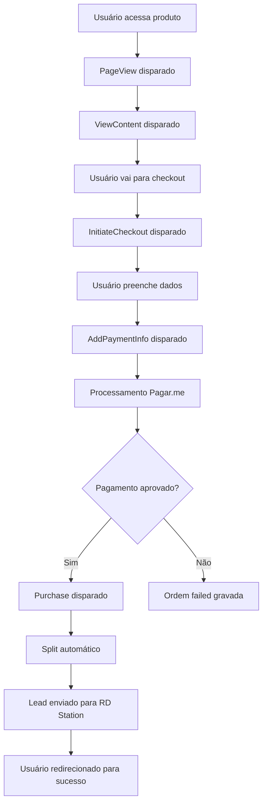

# Documentação Técnica - Plataforma Pagarme

## 📋 Índice
1. [Visão Geral](#visão-geral)
2. [Arquitetura e Stack](#arquitetura-e-stack)
3. [Estrutura do Banco de Dados](#estrutura-do-banco-de-dados)
4. [Fluxo de Negócio](#fluxo-de-negócio)
5. [Módulos e Funcionalidades](#módulos-e-funcionalidades)
6. [Integrações Externas](#integrações-externas)
7. [Sistema de Tracking](#sistema-de-tracking)
8. [API Endpoints](#api-endpoints)
9. [Configuração e Deploy](#configuração-e-deploy)
10. [Guias de Desenvolvimento](#guias-de-desenvolvimento)

---

## 🎯 Visão Geral

### Conceito Principal
Plataforma de vendas digital focada em **infoprodutos** (cursos, avaliações, combos) com sistema completo de **afiliados**, **tracking de marketing** e **automação de leads**. Desenvolvida para empresas que vendem produtos digitais e precisam de um ecossistema completo de vendas.

### Público-Alvo
- Infoprodutores
- Empresas de educação online
- Negócios com sistema de afiliados
- Marketers digitais que precisam de tracking avançado

### Principais Diferenciais
- **Sistema de Split Automático**: Divisão automática de comissões via Pagar.me
- **Tracking Inteligente**: Pixels otimizados por fonte de tráfego
- **Integração RD Station**: Automação completa de marketing
- **Checkout Customizável**: Interface adaptável por produto
- **Analytics Avançado**: Funil de conversão e métricas detalhadas

---

## 🏗️ Arquitetura e Stack

### Frontend
```typescript
// Stack Principal
- Next.js 14 (App Router)
- React 18 + TypeScript
- Tailwind CSS
- shadcn/ui (componentes)
- Radix UI (primitivos)
- React Hook Form + Zod (formulários)
- TanStack Query (cache de dados)
```

### Backend
```typescript
// Tecnologias
- Next.js API Routes
- Prisma ORM
- PostgreSQL
- NextAuth.js (autenticação)
- Webhooks (Pagar.me)
```

### Integrações
```typescript
// Principais Integrações
- Pagar.me (pagamentos)
- RD Station (automação)
- Facebook Pixel
- Google Ads & Analytics
- TikTok Pixel
- Snapchat Ads
- Vercel Blob (storage)
```

---

## 🗄️ Estrutura do Banco de Dados

### Modelos Principais

#### User (Usuários do Sistema)
```prisma
model User {
  id        String     @id @default(cuid())
  email     String     @unique
  name      String?
  password  String
  role      String     @default("customer")
  active    Boolean    @default(true)
  affiliate Affiliate?
}
```

#### Product (Produtos/Cursos)
```prisma
model Product {
  id          String      @id @default(cuid())
  name        String
  description String?
  active      Boolean     @default(true)
  productType String      @default("evaluation") // evaluation, educational, combo
  courseId    String?
  prices      Price[]
  orderBumps  OrderBump[] 
  coupons     Coupon[]
  pixelConfigs PixelConfig[]
  splitConfigurationId String?
  rdStationConfig RDStationProductConfig?
}
```

#### Order (Pedidos)
```prisma
model Order {
  id                   String     @id @default(cuid())
  customerId           String
  status               String     // pending, paid, failed, cancelled
  amount               Int
  paymentMethod        String     // credit_card, pix
  installments         Int        @default(1)
  affiliateId          String?
  couponId             String?
  splitAmount          Float?
  pagarmeTransactionId String?    @unique
  checkoutId           String?    // Prevenção de duplicatas
  failureReason        String?    // Motivo da falha
  failureCode          String?    // Código específico
  pagarmeResponse      Json?      // Resposta completa da Pagar.me
  attempts             Int        @default(1)
  lastAttemptAt        DateTime?
  items                OrderItem[]
  customer             Customer   @relation(fields: [customerId], references: [id])
  affiliate            Affiliate? @relation(fields: [affiliateId], references: [id])
  coupon               Coupon?    @relation(fields: [couponId], references: [id])
}
```

#### PixelConfig (Configuração de Pixels)
```prisma
model PixelConfig {
  id          String   @id @default(cuid())
  productId   String
  platform    String   // facebook, google_ads, google_analytics, tiktok, snapchat
  pixelId     String   // ID do pixel na plataforma
  enabled     Boolean  @default(true)
  events      Json     // ["PageView", "Purchase", "InitiateCheckout"]
  customCode  String?  @db.Text
  testMode    Boolean  @default(false)
  metadata    Json?
  eventLogs   PixelEventLog[]
}
```

#### PixelEventLog (Log de Eventos de Pixel)
```prisma
model PixelEventLog {
  id            String   @id @default(cuid())
  pixelConfigId String
  eventType     String   // PageView, Purchase, etc
  eventData     Json?    // Dados do evento
  orderId       String?  // Para conversões
  sessionId     String?  // Agrupamento de sessão
  userAgent     String?
  ipAddress     String?
  referrer      String?  // URL anterior
  landingPage   String?  // Primeira página da sessão
  campaign      String?  // UTM campaign
  source        String?  // UTM source
  medium        String?  // UTM medium
  term          String?  // UTM term
  content       String?  // UTM content
  createdAt     DateTime @default(now())
}
```

#### RD Station Integration
```prisma
model RDStationConfig {
  id           String   @id @default(cuid())
  enabled      Boolean  @default(false)
  clientId     String?
  clientSecret String?
  accessToken  String?
  refreshToken String?
  tokenExpiresAt DateTime?
  syncEvents   Json     @default("[]") // Eventos a sincronizar
  leadMapping  Json     @default("{}") // Mapeamento de campos
  autoSync     Boolean  @default(true)
  syncInterval Int      @default(300)
  lastSyncAt   DateTime?
  totalSynced  Int      @default(0)
  syncLogs     RDStationSyncLog[]
}

model RDStationSyncLog {
  id             String   @id @default(cuid())
  configId       String
  pixelEventId   String?  // Referência ao evento original
  eventType      String   // Tipo original
  rdEventType    String   // Tipo mapeado para RD
  leadEmail      String?
  leadData       Json?    // Dados enviados
  status         String   // pending, success, error, retrying
  attempts       Int      @default(1)
  maxRetries     Int      @default(3)
  rdStationId    String?  // ID no RD Station
  response       Json?
  errorMessage   String?
  scheduledAt    DateTime @default(now())
  processedAt    DateTime?
}
```

---

## 🔄 Fluxo de Negócio

### 1. Fluxo de Venda Completo


### 2. Sistema de Split de Comissões
```typescript
// Exemplo de split automático
const splitRules = [
  {
    amount: 80, // 80% para empresa
    recipient_id: process.env.PAGARME_MAIN_RECIPIENT_ID,
    type: "percentage",
    options: {
      liable: true,
      charge_processing_fee: true,
      charge_remainder_fee: true,
    },
  },
  {
    amount: 20, // 20% para afiliado
    recipient_id: affiliate.recipientId,
    type: "percentage",
    options: {
      liable: false,
      charge_processing_fee: false,
      charge_remainder_fee: false,
    },
  },
];
```

### 3. Fluxo de Tracking Inteligente
```typescript
// Lógica de disparo condicional de pixels
const shouldFirePixel = (platform: string, trafficSource: any) => {
  switch (platform) {
    case "facebook":
      // Só dispara para tráfego pago do Facebook/Instagram
      return (trafficSource.source === "facebook" || 
              trafficSource.source === "instagram") && 
             trafficSource.medium === "cpc";
    
    case "google_ads":
      // Só dispara para Google Ads
      return trafficSource.source === "google" && 
             trafficSource.medium === "cpc";
    
    case "google_analytics":
      // Recebe todos os eventos
      return true;
  }
};
```

---

## 📦 Módulos e Funcionalidades

### 1. Sistema de Autenticação
**Localização:** `app/(auth)/`
**Tecnologia:** NextAuth.js

```typescript
// Configuração de autenticação
export const authOptions: NextAuthOptions = {
  adapter: PrismaAdapter(prisma),
  providers: [
    CredentialsProvider({
      // Autenticação por email/senha
      credentials: {
        email: { label: "Email", type: "email" },
        password: { label: "Password", type: "password" }
      },
      async authorize(credentials) {
        // Validação customizada
      }
    })
  ],
  session: { strategy: "jwt" },
  // Callbacks para personalização
};
```

### 2. Sistema de Checkout
**Localização:** `app/(checkout)/`
**Recursos:**
- Checkout responsivo
- Múltiplos métodos de pagamento
- Order bumps dinâmicos
- Validação de cupons
- Prevenção de duplicatas

```typescript
// API de checkout - app/api/checkout/route.ts
export async function POST(request: Request) {
  // 1. Validação de dados
  // 2. Verificação de duplicatas (checkoutId)
  // 3. Processamento via Pagar.me
  // 4. Criação do pedido
  // 5. Disparo de eventos
  // 6. Tratamento de erros
}
```

### 3. Dashboard Administrativo
**Localização:** `app/(dashboard)/`
**Funcionalidades:**
- Métricas de vendas
- Gestão de produtos
- Configurações de checkout
- Analytics detalhado
- Gestão de afiliados
- Configuração de pixels

### 4. Sistema de Pixels
**Localização:** `components/tracking/`, `lib/tracking/`
**Características:**
- Carregamento condicional
- Prevenção de duplicatas
- Tracking de UTMs
- Detecção de fonte de tráfego
- Log detalhado de eventos

```typescript
// Pixel Manager - components/tracking/pixel-manager.tsx
export function PixelManager({ pixels, eventData }: PixelManagerProps) {
  // Carregamento inteligente de pixels
  // Rastreamento de eventos
  // Prevenção de duplicatas
  // Log de eventos para analytics
}
```

### 5. Integração RD Station
**Localização:** `app/(dashboard)/integrations/rd-station/`
**Recursos:**
- Autenticação OAuth
- Sincronização automática de leads
- Mapeamento de campos customizável
- Log de sincronizações
- Retry automático

---

## 🔌 Integrações Externas

### 1. Pagar.me (Gateway de Pagamento)
**Arquivo:** `lib/pagarme.ts`

```typescript
export class PagarmeClient {
  // Criação de transações
  async createTransaction(params: TransactionParams): Promise<PagarmeTransaction>
  
  // Pagamento PIX
  async createPixPayment(params: PixPaymentOptions): Promise<PagarmeTransaction>
  
  // Pagamento cartão
  async createCreditCardPayment(params: CreditCardPaymentOptions): Promise<PagarmeTransaction>
  
  // Gestão de recebedores (afiliados)
  async createRecipient(data: Recipient): Promise<RecipientResponse>
  async listRecipients(): Promise<RecipientListResponse>
  
  // Webhook validation
  validateWebhookSignature(signature: string, payload: string): boolean
}
```

### 2. RD Station (Automação de Marketing)
**Endpoints:** `app/api/integrations/rd-station/`

```typescript
// Fluxo OAuth
GET  /api/integrations/rd-station/config     // Buscar configuração
POST /api/integrations/rd-station/config     // Salvar configuração
GET  /api/integrations/rd-station/callback   // Callback OAuth
POST /api/integrations/rd-station/disconnect // Desconectar
POST /api/integrations/rd-station/sync       // Sincronização manual
```

### 3. Pixels de Tracking
**Plataformas Suportadas:**
- Facebook Pixel
- Google Ads
- Google Analytics 4
- TikTok Pixel
- Snapchat Ads

```typescript
// Configuração de pixel
interface PixelConfig {
  platform: 'facebook' | 'google_ads' | 'google_analytics' | 'tiktok' | 'snapchat';
  pixelId: string;
  enabled: boolean;
  events: PixelEvent[];
  testMode?: boolean;
}
```

---

## 📊 Sistema de Tracking

### 1. Eventos Principais
```typescript
type PixelEvent = 
  | "PageView"        // Visualização de página
  | "ViewContent"     // Visualização de produto
  | "InitiateCheckout"// Início do checkout
  | "AddPaymentInfo"  // Dados de pagamento
  | "Purchase"        // Compra finalizada
  | "Lead"           // Lead capturado
  | "CompleteRegistration"; // Registro completo
```

### 2. Detecção de Fonte de Tráfego
```typescript
// lib/tracking/pixel-manager.tsx
const getTrafficSource = () => {
  // 1. UTMs da URL atual (prioridade máxima)
  // 2. UTMs salvos na sessão
  // 3. UTMs do referrer
  // 4. Detecção por hostname do referrer
  // 5. Tráfego direto (fallback)
  
  return {
    source: string,    // google, facebook, direct
    medium: string,    // cpc, organic, social
    campaign: string,  // UTM campaign
    term: string,      // UTM term
    content: string,   // UTM content
    referrer: string,  // URL anterior
    landingPage: string // Primeira página
  };
};
```

### 3. Prevenção de Duplicatas
```typescript
// Sistema de cache de eventos
const firedEvents = useRef<Set<string>>(new Set());

const fireEvent = (eventName: string) => {
  const eventKey = `${eventName}-${pathname}-${getSessionId()}`;
  
  if (!firedEvents.current.has(eventKey)) {
    firedEvents.current.add(eventKey);
    // Disparar evento
  } else {
    // Event já disparado, skip
  }
};
```

---

## 🌐 API Endpoints

### Checkout e Pagamentos
```typescript
POST /api/checkout                    // Processar pedido
GET  /api/orders/[orderId]/status     // Status do pedido
POST /api/webhooks/pagarme            // Webhook Pagar.me
```

### Gestão de Produtos
```typescript
GET    /api/products                  // Listar produtos
GET    /api/products/[productId]      // Buscar produto
POST   /api/products                  // Criar produto
PUT    /api/products/[productId]      // Atualizar produto
DELETE /api/products/[productId]      // Deletar produto
```

### Afiliados
```typescript
GET  /api/affiliates                  // Listar afiliados
POST /api/affiliates                  // Criar afiliado
GET  /api/affiliates/[affiliateId]    // Buscar afiliado
PUT  /api/affiliates/[affiliateId]    // Atualizar afiliado
```

### Analytics e Pixels
```typescript
POST /api/pixels/events               // Log evento de pixel
GET  /api/analytics/funnel            // Funil de conversão
GET  /api/analytics/traffic-sources   // Fontes de tráfego
GET  /api/dashboard/metrics           // Métricas do dashboard
```

### RD Station
```typescript
GET  /api/integrations/rd-station/config     // Configuração
POST /api/integrations/rd-station/config     // Salvar config
GET  /api/integrations/rd-station/callback   // OAuth callback
POST /api/integrations/rd-station/sync       // Sincronizar
POST /api/integrations/rd-station/test       // Testar conexão
```

---

## ⚙️ Configuração e Deploy

### Variáveis de Ambiente
```bash
# Database
DATABASE_URL="postgresql://..."

# NextAuth
NEXTAUTH_SECRET="..."
NEXTAUTH_URL="http://localhost:3000"

# Pagar.me
PAGARME_SECRET_KEY="..."
PAGARME_PUBLIC_KEY="..."
PAGARME_WEBHOOK_SECRET="..."
PAGARME_MAIN_RECIPIENT_ID="..."

# Vercel Blob (Storage)
BLOB_READ_WRITE_TOKEN="..."

# RD Station (opcional)
RD_STATION_CLIENT_ID="..."
RD_STATION_CLIENT_SECRET="..."
```

### Comandos de Desenvolvimento
```bash
# Instalação
npm install

# Desenvolvimento
npm run dev

# Banco de dados
npx prisma generate
npx prisma migrate dev
npx prisma migrate deploy

# Build
npm run build
npm run start

# Lint
npm run lint
```

### Deploy Vercel
```bash
# Configuração automática via vercel.json
npm run vercel-build  # Inclui prisma generate + migrate + build
```

---

## 🧑‍💻 Guias de Desenvolvimento

### 1. Adicionando Novo Produto
```typescript
// 1. Criar produto no dashboard
// 2. Configurar preços
// 3. Definir pixels (opcional)
// 4. Configurar order bumps (opcional)
// 5. Criar cupons (opcional)
// 6. Testar checkout
```

### 2. Configurando Novo Pixel
```typescript
// 1. Criar PixelConfig no banco
const pixelConfig = {
  productId: "product_id",
  platform: "facebook", // ou outra plataforma
  pixelId: "123456789",
  enabled: true,
  events: ["PageView", "ViewContent", "Purchase"],
  testMode: false
};

// 2. Pixel será carregado automaticamente via PixelManager
```

### 3. Adicionando Novo Afiliado
```typescript
// 1. Criar recipient na Pagar.me
const recipient = await pagarme.createRecipient({
  name: "Nome do Afiliado",
  email: "afiliado@email.com",
  document: "12345678901",
  type: "individual",
  // ... outros dados
});

// 2. Criar afiliado no sistema
const affiliate = await prisma.affiliate.create({
  data: {
    userId: user.id,
    commission: 20.0, // 20%
    recipientId: recipient.id,
    active: true
  }
});
```

### 4. Personalizando Checkout
```typescript
// Configuração via CheckoutSettings
const settings = {
  companyName: "Sua Empresa",
  logoUrl: "https://...",
  primaryColor: "#3B82F6",
  checkoutTitle: "Finalize sua compra",
  showInstallments: true,
  maxInstallments: 12,
  enableOrderBumps: true,
  // ... outras configurações
};
```

### 5. Troubleshooting Comum

#### Pixel não disparando
```typescript
// Verificar:
1. PixelConfig.enabled = true
2. Evento está na lista PixelConfig.events
3. Plataforma corresponde à fonte de tráfego
4. Não está em testMode
5. Verificar logs no console
```

#### Erro de Split
```typescript
// Verificar:
1. PAGARME_MAIN_RECIPIENT_ID configurado
2. Afiliado tem recipientId válido
3. Soma das porcentagens = 100%
4. Recipient ativo na Pagar.me
```

#### RD Station não sincronizando
```typescript
// Verificar:
1. Tokens OAuth válidos
2. Configuração de eventos habilitada
3. Mapeamento de campos correto
4. Logs de sincronização (RDStationSyncLog)
```

---

## 📈 Métricas e KPIs

### Dashboard Principal
- Total de vendas
- Conversão por fonte de tráfego
- Performance de afiliados
- Funil de conversão
- Análise de UTMs

### Relatórios Disponíveis
- Transações por período
- Performance de produtos
- Análise de cupons
- Relatório de pixels
- Sincronização RD Station

---

## 🔒 Segurança

### Headers Configurados
- X-Frame-Options: DENY
- X-Content-Type-Options: nosniff
- Referrer-Policy: origin-when-cross-origin
- Strict-Transport-Security
- Content Security Policy

### Validação de Dados
- Zod para validação de schemas
- Sanitização de inputs
- Validação de webhooks
- Rate limiting (implícito via Vercel)

### Autenticação
- JWT sessions
- Bcrypt para senhas
- Middleware de proteção de rotas
- Validação de permissões por role

---

## 📝 Considerações Finais

### Pontos Fortes
1. **Arquitetura escalável** - Next.js App Router + Prisma
2. **Tracking inteligente** - Otimizado por fonte de tráfego
3. **Integração completa** - Pagar.me + RD Station
4. **Sistema de split robusto** - Comissões automáticas
5. **Interface moderna** - shadcn/ui + Tailwind

### Próximos Passos Sugeridos
1. Implementar mais plataformas de pixel (Twitter, LinkedIn)
2. Adicionar relatórios avançados
3. Sistema de notificações
4. App mobile
5. Integração com mais CRMs

### Manutenção
- Logs detalhados em todos os módulos
- Tratamento de erro robusto
- Sistema de retry para APIs externas
- Monitoramento via console logs
- Backup automático de configurações

---

*Documento gerado automaticamente - Versão 1.0*
*Data: 2025-08-28*